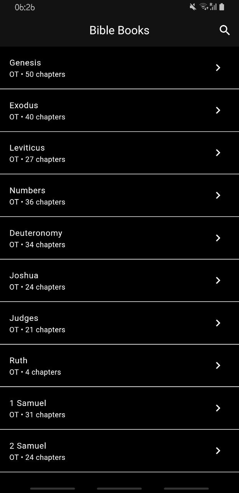
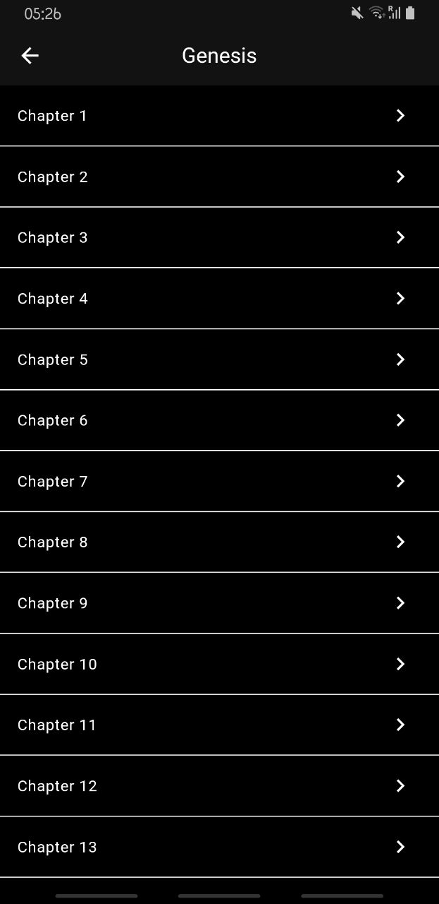
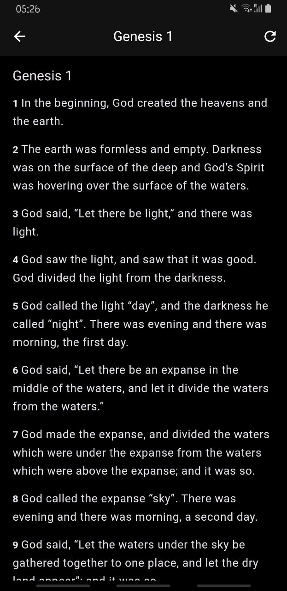

# 📖 Flutter Bible App

A production-grade Bible Reader application built with Flutter. This project demonstrates the evolution of an app from a static UI to a scalable, clean-architecture solution using **Riverpod** and the **Bible API**.

---

## 📸 Screenshots

| Book List | Chapter List | Chapter Reading | Verse Search |
|:---:|:---:|:---:|:---:|
|  |  | |  |

---

## Key Features

*   **Scripture Navigation:** Browse Books of the Bible (Old & New Testament).
*   **Reading Experience:** distraction-free chapter and verse reading.
*   **Search Engine:** Instant verse and keyword search using API integration.
*   **State Management:** Reactive UI updates using **Riverpod**.
*   **Architecture:** Scalable **Clean Architecture** (Domain, Data, Presentation).

---

## Project Structure (Curriculum)

This repository is divided into 4 distinct projects, representing the weekly evolution of the bootcamp:

*   **`week_1_ui_foundations/`**
    *   Static UI only (Widget layouts, Navigation).
    *   Uses dummy data (No API).
*   **`week_2_bible_api/`**
    *   Integration with [Bible API](https://bible-api.com/).
    *   Uses `Dio` for networking and basic JSON parsing.
*   **`week_3_clean_arch/`**
    *   Refactored into **Clean Architecture**.
    *   Implements **Riverpod** for state management.
    *   Strict separation: *Data Sources → Repositories → Use Cases → Providers*.
*   **`week_4_advanced/`** (Final Version)
    *   Adds **Search** functionality with Debouncing.
    *   Advanced error handling and sealed states.
    *   Production-ready polish.

---

## Tech Stack

*   **Framework:** Flutter & Dart
*   **State Management:** Flutter Riverpod
*   **Networking:** Dio
*   **Architecture:** Clean Architecture
*   **Reactive Programming:** RxDart (for search debouncing)
*   **API:** [Bible API](https://bible-api.com/) (Public & Free)

---

## Getting Started

To run the final version of the app:

1.  **Clone the repository:**
    ```bash
    git clone https://github.com/yourusername/flutter-bible-app.git
    ```

2.  **Navigate to the final project directory:**
    ```bash
    cd week_4_advanced
    ```

3.  **Install dependencies:**
    ```bash
    flutter pub get
    ```

4.  **Run the app:**
    ```bash
    flutter run
    ```
